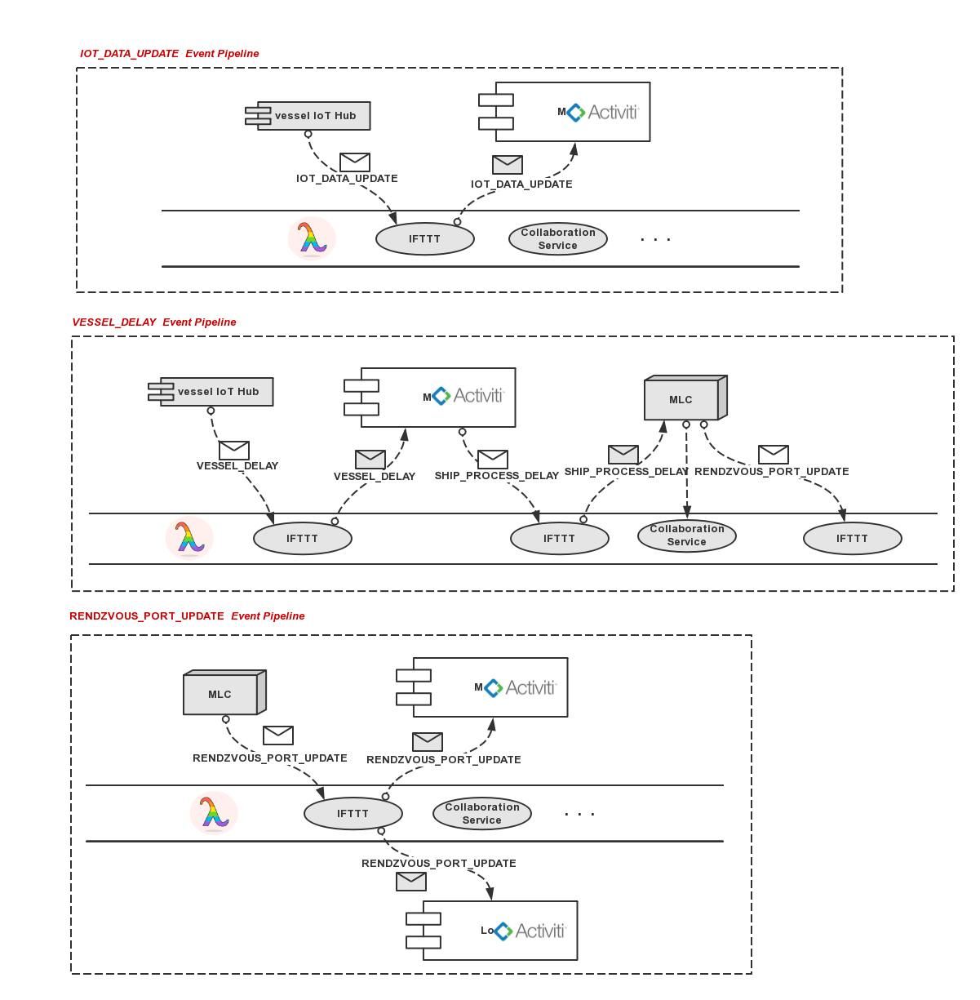
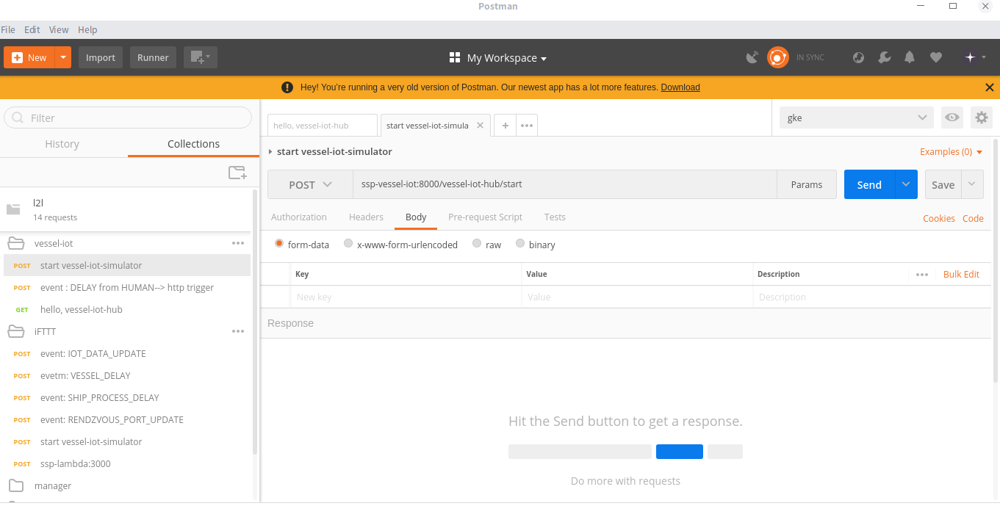

# L2L Framework

The experiment aims to demonstrate the L2L framework proposed in our paper how to achieve on-the-fly collaboration of legacy business process systems in an open environment in a nonintrusive, lightweight and flexible manner. The architecure of L2L is as follows: :point_down:
<center>

<strong></strong>
</center>

Initially , our business scenario originated from  Ship Spare Parts (SSP) problem in China shipping company. There are four participants, namely `Shipping Company` ,`Supplier Company` and `Logistics Company`. Their enterprise legacy systems are isolated and heterogeneous, like the cubic nodes shown in the architecture diagram.The current enterprise legacy system is mainly composed of `EISs`, `Traditional Workflow` and other `white components` inside nodes. The `Traditional workflow` is dedicated to handle the intra-enterprise business , and can not be directly integrate with external enterprise systems and internal emerging components, like IoT infrastructure. On the premise of maintaining highly autonomy of each system, L2L introduces some new components and concepts to bridge different enterprise systems so as to facilitate information comunication and cross-enterprise business decision-making. Inside the cubic nodes, such as  `Shipping Company`,  the grey components are newly introduced, which is in charge of internal or external collaboration.
- ***IoT Hub*** : `IoT Hub` manages an IoT device as a single `Business Entity` and allows `Human Interaction`.
- ***Serverless Funtions*** : We implements **`IFTTT`**,**`Collaboration Service`** by `Serverless Function Framwork`
- ***Context Sharing*** : Enterprises can selectively expose internal information to the outside world via `Context Sharing`
- ***Event Gateway*** :
- ***Annotation-enable Workflow*** : We extend the traditional workflow to facilitate business process collaboration across diverse enterprises, and patch annotations on  the process definition to flexibly  adapt to emerging business scenarios , not only SSP problem , but also cold chain transportation, IoT scenarios. To see more [here](annotation.md).
- ***Inra-enterprise Coordinator*** : eg. **`vmc`** component
- ***Inter-enterprise Coordinator*** : such as **`Manager-Logistics Coordinator(MLC)`** , they can perceive the event from **`IFTTT`** and deal with them by `decision-making`.
- ***Policy Repository*** ：
## Quick Start

## Prerequisite

If you want to quickly setup all the components and try out,  The prerequisite is that **5 virtual machines (ubuntu 18.04,8cores+16G)** need to be prepared, and [JDK8](https://www.oracle.com/technetwork/java/javase/downloads/jdk8-downloads-2133151.html), [Maven](http://maven.apache.org/) and other softwares need to be installed on each node.
- add these hosts to /etc/hosts.

	 host | ip
	-- | --
	ssp-manager | xxx
	ssp-vessel-iot | xxx
	ssp-logistics | xxx
	ssp-mlc | xxx
	ssp-lambda | xxx  |  

## Detailed Guide

### Setup the L2L cluster environment

| Sr. No. | Step details           |                    Link                    |
|:------- |:---------------------- |:------------------------------------------:|
| 1       | Setup `vessel-iot-hub` |        [Link](/shipping-company/IoT-hubs/vessel-IoT-hub/README.md)         |
| 2       | Setup `manager`        | [Link](/shipping-company/workflow/manager/README.md) |
| 3       | Setup `mlc`        |       [Link](/Coordinators/mlc/README.md)       |
| 4       | Setup `logistics`        |       [Link](/logistics-company/workflow/logistics/README.md)       |
|5|Setup `aws-lambda`|[Link](/IFTTT/README.md)|

### Examples for Integration Testing With IFTTT
<center>

<strong></strong>
</center>

In an open environment, many uncertain asynchronous events will be thrown out. We use **`IFTTT Serverless Function`** to distribute the source events to the desired destinations. When some event trigger the `IFTTT`,  regardless of the trigger manners, eg. http trriger, kafka messge queue triger.etc, the `IFTTT` will check the condition, namely `this` of the `IFTTT` concept, to determine which destinations are desired. these filter conditions is configured in [rule.yaml](IFTTT/rule.yaml).  

#### Step1 : Interact with your Application
If you don't have Postman installed already, install the [Postman client](https://www.getpostman.com/) on your machine. then import the [l2l.postman_collection.json](l2l.postman_collection.json) to your postman client.
<center>

<strong></strong>
</center>

- **IOT-DATA-UPDATE** :

	 source |  destination | event_id | event_type
	| ------ | ------ | ------ |------ |
	 ssp-vessel-iot | ssp-manager| 1111 | IOT_DATA_UPDATE
	 - `Start the vessel-iot simulator` : In postman, send the http POST request named `start vessel-iot-simulator` to start the simulator. then the simulator will generate IoT events schedulely. Here we use HTTP trigger to trigger IFTTT Function execution.
	 - At the manager end , event will be received like following:
		 ```json
		 {
		  "event" : {
		  	"event_type" : "IOT_DATA_UPDATE",
		  	"event_id" : "0002"
		  },
		  "context" : {
		  	"vid" : "413362260",
		  	"longitude" : 114.54404,
		  	"latitude" : 30.66266,
		  	"speed" : 7.3,
		  	"timeStamp" : "2019-01-28 11:37:23"
		  	}
		}
		 ```
- **VESSEL-DELAY** :

	 source |  destination | event_id | event_type
	| ------ | ------ | ------ |------ |
	ssp-manager | ssp-manager| 1113| VESSEL_DELAY
	
	- when the simulator is running , human can post request named `DELAY from HUMAN--> http trigger` to propagate the delay event to the manager.
	- At the manager end , the event will be received like following:
		```json
		{
	    "event": {
	        "event_type": "VESSEL_DELAY",
	        "event_id": "1113"
	    	},
	    "context": {
	        "vid": "413362260",
	        "timeStamp": "2019-01-29 23:51:20",
	        "reason": "HUMAN_NOTIFICATION",
	        "zoomInVal": 1000,
	        "dx": 18000000,
	        "stepIndex": 0,
	        "dy": -7200000,
	        "startTime": "2019-01-29 20:48:56",
	        "unit_type": "MILLs",
	        "steps": [
	            {
	                "prePort": "起始点",
	                "nextPort": "黄石",
	                "voyagingDuration": 20040000,
	                "anchoringDuration": 18000000,
	                "dockingDuration": 39600000
	            },
	            {
	                "prePort": "黄石",
	                "nextPort": "武穴",
	                "voyagingDuration": 12720000,
	                "anchoringDuration": 0,
	                "dockingDuration": 21600000
	            },
			# some data omitted ....

	        ],
	        "status": "VOYAGING"
	      }
	 	}
		```

- **SHIP_PROCESS_DELAY** :

   source |  destination | event_id | event_type
  | ------ | ------ | ------ |------ |
  ssp-manager | ssp-mlc| 1114 | SHIP_PROCESS_DELAY
  - Under folder `l2l/manager` in postman, for simulation,  you can post request named `VESSEL_DELAY: http_trigger` to  propagate the delay event to the mlc.
  - At the mlc end , the event will be received like following:
	  ```json
	  {
	    "event": {
	        "event_type": "SHIP_PROCESS_DELAY",
	        "event_id": "1114"
	    },
	    "context": {
	        "serviceVersion": "v2.0.1",
	        "inboundVariables": {
	            "vid": "413362260",
	            "zoomInVal": 1000,
	            "vesselSchedule": [
	                {
	                    "prePort": "起始点",
	                    "nextPort": "黄石",
	                    "estimateAnchorBeginTime": "2019-01-30 02:22:56",
	                    "estimateDockingBeginTime": "2019-01-30 13:22:56",
	                    "estimateDockingEndTime": "2019-01-30 18:22:56"
	                },
	                {
	                    "prePort": "黄石",
	                    "nextPort": "武穴",
	                    "estimateAnchorBeginTime": "2019-01-30 21:54:56",
	                    "estimateDockingBeginTime": "2019-01-31 03:54:56",
	                    "estimateDockingEndTime": "2019-01-31 03:54:56"
	                },
	                {
	                    "prePort": "武穴",
	                    "nextPort": "九江",
	                    "estimateAnchorBeginTime": "2019-01-31 06:06:56",
	                    "estimateDockingBeginTime": "2019-01-31 12:06:56",
	                    "estimateDockingEndTime": "2019-01-31 12:06:56"
	                },
	               # some data omitted ....
	            ],
	            "stepIndex": 0,
	            "startTime": "2019-01-29 20:48:56"
	        },
	        "processInstanceId": "ba238744-we70-12e8-ef4w-215f69sec253",
	        "processDefinitionId": "VesselProcess:1:d4053a34-3r23-23e4-9324-1s234c14232w",
	        "serviceFullName": "coordinate the redezvous port",
	        "appVersion": "v1.0.1",
	        "activityElementId": "w3321r28-5jd0-1s58-s834-218d3h3n42o9",
	        "appName": "Shipping Company",
	        "serviceName": "coodinate-rend-port",
	        "outBoundVariables": [
	            "rendzvous_port",
	            "timeStamp",
	            "warehousing_cost",
	            "postage_cost"
	        ]
	    }
	}
	  ```
- **RENDZVOUS-PORT-UPDATE** :
	
	source |  destination | event_id | event_type
  | ------ | ------ | ------ |------ |
  ssp-mlc | ssp-manager| 2221| RENDZVOUS_PORT_UPDATE
  - Similar to the above , the event is received like follows;
	  ```json
	  {
	    "event": {
	        "event_type": "RENDZVOUS_PORT_UPDATE",
	        "event_id": "2221"
	    },
	    "context": {
	        "context": {
	            "vid": "413362260",
	            "timeStamp": 8215.56,
	            "processInstanceId": "ba238744-we70-12e8-ef4w-215f69sec253",
	            "processDefinitionId": "VesselProcess:1:d4053a34-3r23-23e4-9324-1s234c14232w",
	            "warehousing_cost": 5278.24,
	            "activityElementId": "w3321r28-5jd0-1s58-s834-218d3h3n42o9",
	            "postage_cost": 2315.56,
	            "appName": "mlc",
	            "rendzvous_port": "安庆"
	        }
	    }
	}
	  ```
  from |  to | event_id | event_type
  | ------ | ------ | ------ |------ |
  ssp-mlc | ssp-logistics | 2222 | RENDZVOUS_PORT_UPDATE
	- the event is received like follows;
		```json
		{
	    "event": {
	        "event_type": "RENDZVOUS_PORT_UPDATE",
	        "event_id": "2222"
	    },
	    "context": {
	        "context": {
	            "timeStamp": 8215.56,
	            "processInstanceId": "sd923864-89ef-a283-edw2-s8d5n3e2345f",
	            "processDefinitionId": "WagonProcess:2:sk7293d5-4b62-347s-8d24-sj5x23ld726s",
	            "wid": "W51252378",
	            "warehousing_cost": 1478.24,
	            "activityElementId": null,
	            "postage_cost": 5215.56,
	            "appName": "mlc",
	            "rendzvous_port": "安庆"
	        }
	     }
	 	}
		```
